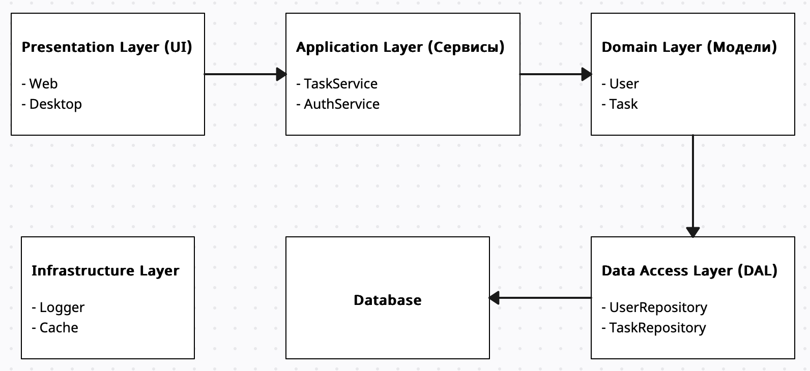

# Основные сущности (классы и таблицы в БД)

## Таблицы в БД

### Пользователь (User)

- **Поля:**
  - `Id` (int, primary key)
  - `Username` (string, уникальный)
  - `PasswordHash` (string)

### Задача (Task)

- **Поля:**
  - `Id` (int, primary key)
  - `Title` (string)
  - `Description` (string)
  - `CreatedDate` (DateTime)
  - `Deadline` (DateTime)
  - `Status` (enum: New, InProgress, Completed)
  - `Priority` (enum: Low, Medium, High)
  - `UserId` (int, foreign key на таблицу `Users`)

## Классы

### Сущности (Domain Models)

#### Пользователь (User)
```csharp
public class User
{
    public int Id { get; set; }
    public string Username { get; set; }
    public string PasswordHash { get; set; }
    public List<Task> Tasks { get; set; } = new List<Task>();
}
```

#### Задача (Task)
```csharp
public class Task
{
    public int Id { get; set; }
    public string Title { get; set; }
    public string Description { get; set; }
    public DateTime CreatedDate { get; set; }
    public DateTime Deadline { get; set; }
    public TaskStatus Status { get; set; } // enum: New, InProgress, Completed
    public TaskPriority Priority { get; set; } // enum: Low, Medium, High
    public int UserId { get; set; } // foreign key на пользователя
    public User User { get; set; } // [optional???]
}
```

#### Перечисления (Enums)
```csharp
public enum TaskStatus
{
    New,
    InProgress,
    Completed
}

public enum TaskPriority
{
    Low,
    Medium,
    High
}
```

### Сервисы (Application Layer)

#### Сервис для работы с задачами (TaskService)
```csharp
public class TaskService
{
    public TaskService() {}
    public Task CreateTask(string title, string description, DateTime deadline, TaskPriority priority, int userId) {}
    public Task UpdateTask(int taskId, string title, string description, DateTime deadline, TaskStatus status, TaskPriority priority) {}
    public void DeleteTask(int taskId) {}
    public List<Task> GetTasksByUser(int userId) {}
}
```

#### Сервис для аутентификации (AuthService)
```csharp
public class AuthService
{
    public AuthService() {}
    public User Register(string username, string password) {}
    public User Login(string username, string password) {}
    private string HashPassword(string password) {}
    private bool VerifyPassword(string password, string passwordHash) {}
}
```

### Репозитории (Data Access Layer)

#### Репозиторий для задач (TaskRepository)
```csharp
public class TaskRepository : ITaskRepository
{
    public TaskRepository() {}
    public Task Add(Task task) {}
    public Task Update(Task task) {}
    public void Delete(int taskId) {}
    public Task GetById(int taskId) {}
    public List<Task> GetByUserId(int userId) {}
}
```

#### Репозиторий для пользователей (UserRepository)
```csharp
public class UserRepository : IUserRepository
{
    public UserRepository() {}
    public User Add(User user) {}
    public User GetByUsername(string username) {}
    public User GetById(int userID) {}
}
```

### Интерфейсы (Abstractions)

#### Интерфейс для репозитория задач (ITaskRepository)
```csharp
public interface ITaskRepository
{
    Task Add(Task task);
    Task Update(Task task);
    void Delete(int taskId);
    Task GetById(int taskId);
    List<Task> GetByUserId(int userId);
}
```

#### Интерфейс для репозитория пользователей (IUserRepository)
```csharp
public interface IUserRepository
{
    User Add(User user);
    User GetByUsername(string username);
    User GetByID(int userID);
}
```

### Вспомогательные классы

#### Логгер (Logger)
```csharp
public static class Logger
{
    public static void Log(string message) {}
}
```

#### Шифровальщик паролей (PasswordHasher)
```csharp
public static class PasswordHasher
{
    public static void HashPassword(string passwrod) {}
    public static void VerifyPassword(string passwrod) {}
}
```

# Многослойная архитектура

Проект будет разделен на следующие слои:

1. **Presentation Layer (UI):**
   - веб-интерфейс
   - десктоп-приложение

2. **Application Layer (Сервисы):**
   - слой для обработки бизнес-логики
   - сервисы (AuthService, TaskService)

3. **Domain Layer (Доменные модели):**
   - содержит основные сущности (User, Task), enums (TaskStatus, TaskPriority) и бизнес-правила

4. **Data Access Layer (DAL):**
   - слой для работы с базой данных: репозитории (UserRepository, TaskRepository)

5. **Infrastructure Layer:**
   - логирование, кэширование, уведомления и другие вспомогательные функции.

## Диаграмма архитектуры



---

# Паттерны проектирования

Для проекта могут быть использованы следующие паттерны проектирования:

## 1. Singleton

- **Использование:** для создания единственного экземпляра логгера (`Logger`) или кэша (`Cache`)
- **Пример:** `Logger.Instance.Log("Message")`

## 2. Repository

- **Использование:** для абстракции доступа к данным (работа с базой данных)
- **Пример:** `UserRepository`, `TaskRepository`

## 3. Factory Method

- **Использование:** для создания объектов задач с разными приоритетами или статусами
- **Пример:** `TaskFactory.CreateTask(Priority.High)`

## 4. Observer
- **Использование:** для уведомлений о изменении статуса задачи (например, отправка уведомлений)
- **Пример:** `TaskStatusNotifier` подписывается на изменения статуса задачи

## 5. Strategy
- **Использование:** для реализации разных алгоритмов сортировки задач (по дате, приоритету, статусу)
- **Пример:** `TaskSorter.SetStrategy(new SortByPriorityStrategy())`

## 6. Decorator
- **Использование:** для добавления дополнительного поведения (например, логирование или кэширование) к сервисам
- **Пример:** `LoggingTaskServiceDecorator` добавляет логирование к `TaskService`
